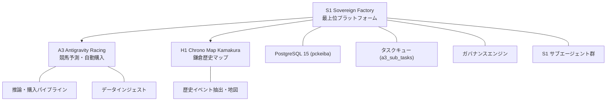

# S1 Sovereign Codex — 02. プラットフォームアーキテクチャ

> **Phase 597 / 2026-05-21 — S1 Sovereign Factory 統合基盤**

## 1. プロジェクト階層

### プロジェクト管理テーブル: `a3_meta.s1_projects`

| project_id | name | description |
|---|---|---|
| S1 | S1 Sovereign Factory | エージェント型開発基盤・全プロジェクト統治 |
| A3 | A3 Antigravity Racing | 競馬予測・IPAT自動購入パイプライン |
| H1 | H1 Chrono Map Kamakura | 鎌倉歴史マップ（Core Rule #14で独立） |

---

## 2. データベーススキーマ構成

PostgreSQL 15 (pckeiba) + pgvector 拡張

| スキーマ | 用途 | 主要テーブル |
|---|---|---|
| `public` | JRDBデータ / JVDテーブル / ステージング | jvd_se, jvd_ra, jvd_um, jvd_hc, jvd_hr, jvd_ks, jvd_ch, jvd_o1〜o6 |
| `api` | A3固有機能 / ビュー / トリガー | v_inference_today, v_ipat_outbox_queue_safe, system_meta_learning_history, a3_auto_bet_logs |
| `a3_meta` | S1プラットフォーム基盤 / タスクキュー / ガバナンス / エージェント | a3_sub_tasks, s1_projects, governance_checks, s1_episodes, s1_agent_messages, s1_prompt_templates, s1_agent_capabilities, s1_goals, session_audit_log, chaos_thresholds, system_secrets |
| `chrono_archive` | H1歴史データ | extracted_events, h1_embed_chunks |

---

## 3. Docker コンテナアーキテクチャ (7コンテナ)

| コンテナ | 役割 | 主要プロセス |
|---|---|---|
| `a3-postgres-15` | データベース | PostgreSQL 15 + pgvector |
| `a3-sovereign-worker` | メインワーカー | a3_pipeline_orchestrator.py (PID 1), dbt, CatBoost, Playwright |
| `a3-bootloader` | 初期化監視 | 5分間隔の自律監視、Gemini API連携 |
| `a3-qdrant` | ベクトルDB | H1 embedding検索 (17,915件) |
| `a3-mlflow` | 実験管理 | MLflow Server (port 5000) |
| `a3-ollama` | ローカルLLM | Ollama実行環境 |
| `a3-hatchet` | ワークフロー | Hatchet Engine |

### Windows Host
- **JV-Link COM連携**: 32bit Python 3.11 + win32com.client で JVDTLab.JVLink COMを直接操作
- `a3_jravan_auto_ingester.py`: dataspec×option組合せ自動取込み

---

## 4. タスクキュー: `a3_meta.a3_sub_tasks`

S1プラットフォームの心臓部。全プロジェクト横断でタスクを管理する。

| 属性 | 値 |
|---|---|
| カラム数 | 27 |
| 主キー | `sub_task_id` |
| ステータス | QUEUED → IN_PROGRESS → COMPLETED / FAILED / ARCHIVED / CANCELLED |
| RECURRING | 16パターン（ユニーク名ベース） |
| プロジェクト分類 | `project_id` カラム（A3/H1/S1/GOV） |

### ディスパッチタイプ

| タイプ | 説明 |
|---|---|
| SQL_EXEC | SQL文を直接実行 |
| DOCKER_EXEC | 指定コンテナでコマンド実行 |
| LLM_PROMPT | LLMにプロンプトを送信 |
| AUDIT | 監査チェック実行 |
| HEALTH_CHECK | ヘルスチェック実行 |
| DB_DDL | DBスキーマ操作 |
| TERMINAL | ターミナルコマンド実行 |
| DBT_OP | dbt操作 |
| BACKUP | バックアップ操作 |
| IPAT_EXEC | IPAT購入実行 |
| DIRECT | 即時完了（メタデータ記録用） |

### RECURRING パターン (16件)
- JRDB Auto Ingestion ×3 (朝昼夕)
- RaceDay Auto系 ×4 (Scheduler/Auto/PREP/START + Full Pipeline)
- TakeTube Auto Collector, Cushion Scraper, Model Recalculation
- JRAVAN Auto Ingestion, IPAT Auto Driver Watcher
- Stale PENDING Bet Cleanup, Duplicate QUEUED Cleanup, H1 RATE_LIMITED Retry

---

## 5. dbt (Data Build Tool) アーキテクチャ

| 項目 | 値 |
|---|---|
| バージョン | dbt-core 1.11.9 + dbt-postgres 1.9.0 |
| テスト | **58/58 全PASS** |
| モデル階層 | staging → intermediate → mart → inference → reporting |
| enabled=false | **0モデル** |
| Source Freshness | 全ソース正常 |

推論チェーン全体がdbt管理下: `v_inference_today` → `v53` → `v55` → `v56` → `v316`

---

## 6. システム統計 (Phase 597時点)

| 項目 | 値 |
|---|---|
| COMPLETED | 1,129,950 |
| QUEUED | 37 |
| FAILED | **0** |
| IN_PROGRESS | 1 (RECURRING自動実行) |
| CANCELLED | 143 |
| ARCHIVED | 1,166 |
| RECURRING | 16パターン |
| Python Files | 55 (全justified) |
| dbt Tests | 58/58 PASS |
| Governance Preflight | 42/42 PASS |
| JRA-VAN テーブル | 13/13 存在 |
| 購入実績 | 直近9レースデー SUCCESS 100% |

*Phase 597 / S1 Sovereign Codex v1.0*

### Phase 6 Architectural Updates
- **DB IDs**: All primary keys across the platform are now `UUID` via `gen_random_uuid()`, completely deprecating SERIAL/Integer keys.
- **Read/Write Schemas**: Reader systems (like H1/A3) must STRICTLY read from the `api` schema. Direct reads from `chrono_archive` or `public` are prohibited.
