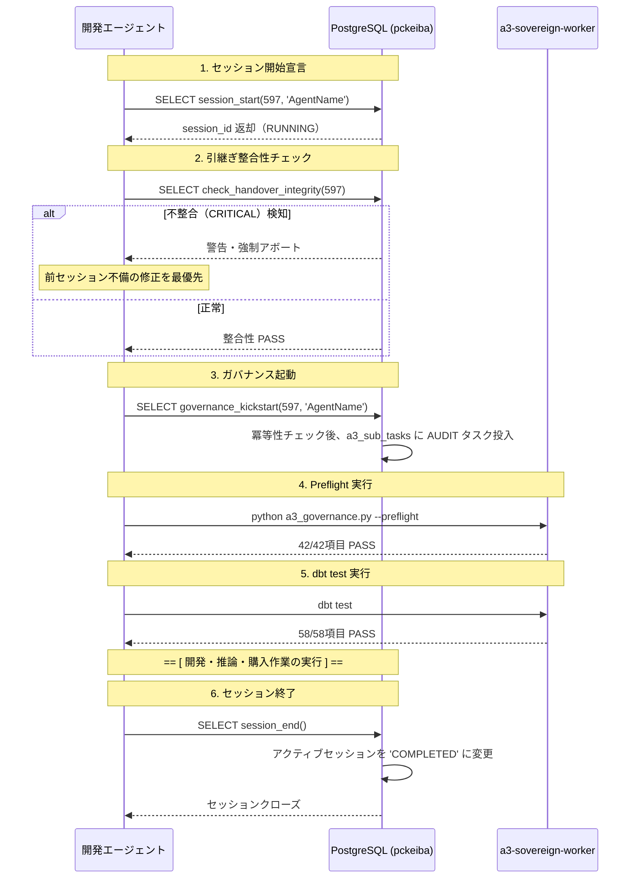

# S1 Sovereign Codex — 03. 統治・監査エンジン

> **Phase 597 / 2026-05-21 — S1 Sovereign Factory 統合ガバナンスアーキテクチャ**

---

## 1. 概要

S1 Sovereign Factory プラットフォームにおけるガバナンスは、システムが自律的に整合性を保ち、コードの自己改変による先祖返りや構造的劣化（アーキテクチャ・ドリフト）を防ぐための「免疫システム」である。

本ガバナンスエンジンは、**「Fat DB / Thin Python」**原則を徹底し、ビジネスルールおよび監査ロジックをPostgreSQL 15データベース内に集約している。Pythonやdbtテストは、DB内に格納されたメタデータおよび動的SQLをキックする薄い実行体として機能する。

S1を最上位とし、その統治下にあるサブプロジェクト（A3 Antigravity Racing、H1 Chrono Map Kamakura）を含めた、全46項目の統合ガバナンスチェック、セッション管理プロトコル、引継ぎ整合性検証、およびダッシュボード連動について本章で定義する。

---

## 2. ガバナンス定義: `a3_meta.governance_checks`

ガバナンスルールのSSOT（Single Source of Truth）となるメタデータテーブル。全ての監査チェックはここに宣言的に定義され、動的に実行される。

### 2.1 テーブル設計 (DDL)

```sql
CREATE TABLE a3_meta.governance_checks (
    check_id VARCHAR(50) PRIMARY KEY,
    project_id VARCHAR(10) NOT NULL REFERENCES a3_meta.s1_projects(project_id),
    check_name VARCHAR(100) NOT NULL,
    description TEXT NOT NULL,
    severity VARCHAR(10) NOT NULL CHECK (severity IN ('CRITICAL', 'WARNING', 'INFO')),
    sql_query TEXT, -- 自動検証用の動的SQL（結果が0またはNULLならPASS、1以上ならFAIL）
    active_status BOOLEAN DEFAULT TRUE NOT NULL,
    created_at TIMESTAMP WITH TIME ZONE DEFAULT CURRENT_TIMESTAMP,
    updated_at TIMESTAMP WITH TIME ZONE DEFAULT CURRENT_TIMESTAMP
);

-- プロジェクト別のインデックス
CREATE INDEX idx_gov_checks_project ON a3_meta.governance_checks(project_id) WHERE active_status = TRUE;
```

### 2.2 プロジェクト別ガバナンスチェックの分類 (全46チェック)

現在登録されている46件のチェックは、プロジェクトおよびレイヤーごとに厳密に分類されている。

| プロジェクト | チェック数 | 統治対象 | 主な検出内容 |
|---|---|---|---|
| **S1 (Sovereign)** | 14件 | エージェント基盤・タスクキュー | タスク重複、ZOMBIEタスク、通信バス健全性、プロンプト進化率、能力整合 |
| **A3 (Antigravity)** | 27件 | 予測・購入パイプライン、データ、ML | 特徴量カラム数、Chaos検知閾値、JRA-VAN/JRDB差分、IPATドライバ、モデル多様性 |
| **H1 (Chrono Map)** | 3件 | 歴史マップ、ベクトルDB | 統一ビュー整合性、embedding未処理数、イベント抽出成功率（Core Rule #14独立） |
| **共通 (GOV)** | 2件 | セッションライフサイクル | session_start/endの一貫性、ハンドオーバーの未更新（先祖返り） |

---

### 2.3 全46チェック詳細カタログ

#### 1) S1プラットフォームガバナンス (14チェック)

| check_id | 重要度 | 名称 | 監査ロジック / SQL検証 |
|---|---|---|---|
| `S1-01` | **CRITICAL** | 重複キュー検知 | `a3_sub_tasks`内の未処理（QUEUED）の重複した非RECURRINGタスクを検出 |
| `S1-02` | **CRITICAL** | ZOMBIEタスク検知 | ステータスが `IN_PROGRESS` で開始から30分以上経過しているものを検出 |
| `S1-03` | **CRITICAL** | 能力レジストリ整合 | 登録されたサブエージェントが、所持していない `s1_agent_capabilities` を要求していないか |
| `S1-04` | **WARNING** | プロンプトテンプレート枯渇 | `s1_prompt_templates` に登録されている特定パターンの成功率が極端に低下していないか |
| `S1-05` | **WARNING** | 通信バス滞留 | `s1_agent_messages` で24時間以上未読（status='SENT'）のメッセージ数を検出 |
| `S1-06` | **WARNING** | エピソード記憶鮮度 | 直近100タスク中、エピソード記憶（`s1_episodes`）の作成率が80%未満になっていないか |
| `S1-07` | **CRITICAL** | ゴール階層循環参照 | `s1_goals` において親・子関係が循環（無限ループ）していないか |
| `S1-08` | **WARNING** | DLQ滞留数 | Dead Letter Queue (`a3_sub_tasks` で status='FAILED' かつ retry_count=max) が50件以上 |
| `S1-09` | **CRITICAL** | シークレット漏洩・未設定 | `system_secrets` 内の必須キー（Gemini API、DB認証情報等）が空またはデフォルト値のまま |
| `S1-10` | **INFO** | エージェントスケール制限 | 並列稼働中の `s1_queue_worker` 数が設定されたシステム上限を超えていないか |
| `S1-11` | **WARNING** | QA検証ゲートバイパス | 自動検証（`s1_qa_verifier`）を通過せずに `COMPLETED` になった実装タスクの検出 |
| `S1-12` | **CRITICAL** | コアシステムDB整合 | S1のシステムメタデータテーブル群（`s1_projects` 等）のスキーマが破壊されていないか |
| `S1-13` | **WARNING** | プロンプト進化停滞 | 過去50回でプロンプトテンプレートの新規バージョン生成（進化）が発生していないか |
| `S1-14` | **INFO** | ログパーテーション鮮度 | エージェント実行ログの肥大化防止用パーテーションが適切にローテーションされているか |

*S1-01 (重複キュー検知) 動的SQL例:*
```sql
SELECT COUNT(*) FROM a3_meta.a3_sub_tasks 
WHERE status = 'QUEUED' 
  AND recurring_pattern_name IS NULL 
GROUP BY project_id, task_type, payload 
HAVING COUNT(*) > 1;
```

---

#### 2) A3サブプロジェクトガバナンス (27チェック)

A3のデータ、特徴量、MLモデル、IPAT自動購入の整合性を担保する。

| check_id | 重要度 | 名称 | 監査ロジック / SQL検証 |
|---|---|---|---|
| `A3-01` | **CRITICAL** | JRA-VANテーブル存在 | `jvd_se` や `jvd_ra` など主要13テーブルの存在を物理スキーマから検証 |
| `A3-02` | **CRITICAL** | JRDB/SED取込み完了 | レース当日のJRDB/SEDデータが規定レコード数以上取り込まれているか |
| `A3-03` | **CRITICAL** | 特徴量カラム数下限 | 予測特徴量ビュー（`v_inference_today` 系統）のカラム数が259カラム以上存在するか |
| `A3-04` | **WARNING** | TakeTube特徴量存在 | YouTube AI特徴量（`feat_tt_*`）が直近の馬データに正しくマッピングされているか（5カラム以上） |
| `A3-05` | **CRITICAL** | クッション値取得鮮度 | 最新レース開催日の馬場クッション値データが取り込まれているか（当日朝7時時点） |
| `A3-06` | **WARNING** | Sire/BMS非ゼロ率 | 競走馬の血統データ（種牡馬・ブルードメアサイアーコード）の有効値（非ゼロ）率が80%以上か |
| `A3-07` | **CRITICAL** | Chaos検知SSOT同期 | `a3_meta.chaos_thresholds` の値と推論モデルの閾値パラメータが一貫しているか |
| `A3-08` | **CRITICAL** | Chaos比率ガード | 本日のレース予測におけるChaos（荒れ模様）判定比率が異常値（0〜20%外）になっていないか |
| `A3-09` | **CRITICAL** | ML MoEモデル活性 | 15専門家モデル(MoE)の内、応答しないモデル（NULL予測）が1つもないか |
| `A3-10` | **CRITICAL** | メタスタッキング活性 | 50層メタスタッキング推論が最終L4スコアを正しく出力しているか |
| `A3-11` | **CRITICAL** | IPAT残高/購入枠一貫 | IPAT投票可能金額とシステム側の購入限度額の整合性（不一致時にサーキットブレイク） |
| `A3-12` | **CRITICAL** | IPAT DOM操作エラー率 | AngularJS SPAに対するPlaywright DOM操作のエラー率が0%であるか |
| `A3-13` | **CRITICAL** | サーキットブレーカー状態 | 連続エラー発生によるIPAT自動購入の緊急停止フラグが意図せず無効化されていないか |
| `A3-14` | **WARNING** | 学習用MATVIEW存在 | 機械学習学習用のマテリアライズドビューが全て正常に生成されているか |
| `A3-15` | **WARNING** | 特徴量ドリフト判定 | `Evidently Quality Gate` により、直近データの入力値が学習時と比べて乖離していないか |
| `A3-16` | **WARNING** | Regime判定分布 | 直近の競馬開催データから分類されたRegime（馬場状態・展開トレンド）が4種以上に多様化しているか |
| `A3-17` | **CRITICAL** | 購入結果100% SUCCESS | 直近の購入結果履歴（`a3_auto_bet_logs`）において、エラーでの失敗が0件であること |
| `A3-18` | **WARNING** | JRA-VANバイトずれ | JV-Linkから取得した `jvd_ra` レコードの固定長パーサーにバイトずれが発生していないか |
| `A3-19` | **WARNING** | 重複投票防止 | 同一レース・同一馬券に対する二重購入の指示がキューに存在しないか |
| `A3-20` | **INFO** | 特徴量欠損値比率 | 推論時に入力される特徴量のNULL（欠損値）比率が全体で5%未満に収まっているか |
| `A3-21` | **WARNING** | 外部AIスコア(VictGrab) | 外部AIスコア（VG）データの直近取込みが正常で、全カラムマッピングが維持されているか |
| `A3-22` | **CRITICAL** | dbtテスト全PASS | dbtのテストが58/58全て `SUCCESS` で終了していること |
| `A3-23` | **INFO** | Heritage DNA一致度 | 遺伝特徴（Heritage DNA）データが対照テーブルと85%以上一致しているか |
| `A3-24` | **WARNING** | レース当日常駐監視 | `RaceDay Auto Scheduler` が正常に起動し、直前オッズ取得等がミリ秒レベルで稼働しているか |
| `A3-25` | **WARNING** | MLflowトラッキング | 全ての機械学習実験パラメータおよびメトリクスがMLflowコンテナに正しく記録されているか |
| `A3-26` | **CRITICAL** | Python正当性タグ | `/app/*.py` の全ファイルに `# A3_PYTHON_JUSTIFICATION` が正しく記述されているか |
| `A3-27` | **WARNING** | 曜日判定整合性 | プログラム内の曜日変換ロジックがJRA開催スケジュールと一致しているか（月曜開催等の特例対応） |

---

#### 3) H1サブプロジェクトガバナンス (3チェック)

A3とは完全に論理・物理的に分離された独立ガバナンス（Core Rule #14）。

| check_id | 重要度 | 名称 | 監査ロジック / SQL検証 |
|---|---|---|---|
| `H1-01` | **CRITICAL** | 統一ビュー整合性 | H1統合歴史イベントビュー `v_h1_unified_events` が正しくクエリ可能か |
| `H1-02` | **WARNING** | Embedding未処理数 | `chrono_archive.extracted_events` 内でQdrantへのベクトル化が未完了のデータ数 |
| `H1-03` | **WARNING** | イベント抽出成功率 | 鎌倉歴史史料ソースの生テキストからのLLMイベント抽出率が現在2.4%以上を維持しているか |

---

#### 4) 共通セッション・引継ぎガバナンス (2チェック)

| check_id | 重要度 | 名称 | 監査ロジック / SQL検証 |
|---|---|---|---|
| `GOV-01` | **CRITICAL** | 引継ぎ整合性（先祖返り） | 前回の作業から設計書（`S1_DESIGN_DOCUMENT.md`）またはメタ学習履歴が更新されているか |
| `GOV-02` | **CRITICAL** | セッション連続性 | `session_start` が宣言された後に、前セッションが正しく `session_end` で閉じられているか |

---

## 3. ガバナンス実行エンジン: PL/pgSQL

S1のガバナンスエンジンは、テーブル駆動で動的SQLを実行し、結果を監査ログに自動挿入するPL/pgSQL関数群で構成されている。

### 3.1 `a3_meta.s1_run_project_governance(project_id TEXT)`

指定されたプロジェクトID（'S1', 'A3', 'H1' または 'ALL'）に基づいて、該当するアクティブなガバナンスチェックを自動巡回実行するメイン関数。

```sql
CREATE OR REPLACE FUNCTION a3_meta.s1_run_project_governance(p_project_id TEXT)
RETURNS TABLE(
    total_checks INT,
    passed_checks INT,
    failed_critical INT,
    failed_warning INT
) AS $$
DECLARE
    r RECORD;
    v_sql TEXT;
    v_result INT;
    v_session_id INT;
    v_status VARCHAR(10);
BEGIN
    total_checks := 0;
    passed_checks := 0;
    failed_critical := 0;
    failed_warning := 0;

    -- 現在稼働中の最新アクティブセッションIDを取得
    SELECT MAX(session_id) INTO v_session_id FROM a3_meta.session_audit_log WHERE status = 'RUNNING';
    IF v_session_id IS NULL THEN
        RAISE WARNING 'アクティブなセッションが見つかりません。デフォルトのシステム監査セッションを使用します。';
        v_session_id := 0;
    END IF;

    -- 該当するアクティブなチェックルールをループ処理
    FOR r IN 
        SELECT check_id, project_id, check_name, severity, sql_query 
        FROM a3_meta.governance_checks
        WHERE active_status = TRUE 
          AND (p_project_id = 'ALL' OR project_id = p_project_id)
    LOOP
        total_checks := total_checks + 1;
        v_result := 0;
        
        -- 動的SQLが定義されている場合は実行
        IF r.sql_query IS NOT NULL AND r.sql_query <> '' THEN
            BEGIN
                -- SQLの実行結果（エラー件数）を取得。0ならパス、1以上なら異常あり
                v_sql := 'SELECT COALESCE((' || r.sql_query || '), 0)';
                EXECUTE v_sql INTO v_result;
            EXCEPTION WHEN OTHERS THEN
                -- SQLエラー時のフォールバック（致命的）
                v_result := 9999;
                RAISE WARNING 'ガバナンスクエリの実行に失敗しました check_id: %, エラー: %', r.check_id, SQLERRM;
            END EXCEPTION;
        END IF;

        -- 判定処理
        IF v_result = 0 THEN
            v_status := 'PASS';
            passed_checks := passed_checks + 1;
        ELSE
            v_status := 'FAIL';
            IF r.severity = 'CRITICAL' THEN
                failed_critical := failed_critical + 1;
                RAISE WARNING '【CRITICAL GOVERNANCE FAILURE】チェック ID: %, 名: %', r.check_id, r.check_name;
            ELSE
                failed_warning := failed_warning + 1;
                RAISE NOTICE '【WARNING GOVERNANCE】チェック ID: %, 名: %', r.check_id, r.check_name;
            END IF;
        END IF;

        -- 実行結果を監査ログテーブルに記録
        INSERT INTO a3_meta.session_audit_log (
            session_id,
            project_id,
            check_id,
            status,
            details,
            executed_at
        ) VALUES (
            v_session_id,
            r.project_id,
            r.check_id,
            v_status,
            'Query returned: ' || v_result::TEXT,
            CURRENT_TIMESTAMP
        );
    END LOOP;

    RETURN NEXT;
END;
$$ LANGUAGE plpgsql;
```

---

### 3.2 `a3_meta.governance_kickstart(phase INT, agent TEXT)`

セッション開始時に、自動的にガバナンス監査タスクを `a3_sub_tasks` キューに投入する関数。

#### Phase 596 における冪等性修正
以前のフェーズでは、セッション開始スクリプトが複数回実行された場合に `[GOV]` タスクがキューに二重・三重に登録され、タスクキューの異常増殖を招いていた。Phase 596において、同一セッション（同一Phaseおよびエージェント名）ですでにQUEUED状態のGOVタスクが存在する場合は、二重投入を行わない冪等性ガードレールがDB側に組み込まれた。

```sql
CREATE OR REPLACE FUNCTION a3_meta.governance_kickstart(
    p_phase INT,
    p_agent TEXT
) RETURNS VOID AS $$
DECLARE
    v_existing_task_count INT;
BEGIN
    -- すでにQUEUED状態の同一ガバナンスキックスタートタスクが存在するか確認
    SELECT COUNT(*) INTO v_existing_task_count
    FROM a3_meta.a3_sub_tasks
    WHERE project_id = 'S1'
      AND task_type = 'AUDIT'
      AND status = 'QUEUED'
      AND payload->>'action' = 'governance_kickstart'
      AND payload->>'phase' = p_phase::TEXT;

    IF v_existing_task_count > 0 THEN
        RAISE NOTICE '重複警告: Phase % のガバナンスキックタスクは既にキューに存在します。新規投入をスキップします。', p_phase;
        RETURN;
    END IF;

    -- 新規ガバナンス監査タスクをキューに投入
    INSERT INTO a3_meta.a3_sub_tasks (
        project_id,
        task_type,
        status,
        payload,
        priority,
        created_at
    ) VALUES (
        'S1',
        'AUDIT',
        'QUEUED',
        jsonb_build_object(
            'action', 'governance_kickstart',
            'phase', p_phase,
            'agent', p_agent,
            'description', 'セッション起動時の自動全システムガバナンス監査実行'
        ),
        100, -- 高プライオリティ
        CURRENT_TIMESTAMP
    );

    RAISE NOTICE 'S1 ガバナンス監査タスクを正常にキューに投入しました (Phase %).', p_phase;
END;
$$ LANGUAGE plpgsql;
```

---

## 4. セッションライフサイクルプロトコル

AIおよび開発者がセッションを開始・終了する際の絶対不可侵のプロトコル。これにより、すべての作業がDBとログにトラッキングされ、構成状態のドリフトを防ぐ。

### 4.1 プロトコルフロー



### 4.2 セッション管理関数

#### `a3_meta.session_start(phase INT, agent TEXT)`

```sql
CREATE OR REPLACE FUNCTION a3_meta.session_start(
    p_phase INT,
    p_agent TEXT
) RETURNS INT AS $$
DECLARE
    v_session_id INT;
BEGIN
    -- 他に稼働中のセッションがあれば強制終了（未クローズセッションの救済）
    UPDATE a3_meta.session_audit_log
    SET status = 'CLOSED_BY_SYSTEM',
        details = 'New session started: ' || p_agent,
        executed_at = CURRENT_TIMESTAMP
    WHERE status = 'RUNNING';

    -- 新規セッションの挿入
    INSERT INTO a3_meta.session_audit_log (
        session_id,
        project_id,
        check_id,
        status,
        details,
        executed_at
    ) VALUES (
        nextval('a3_meta.session_id_seq'),
        'S1',
        'SYSTEM_START',
        'RUNNING',
        'Session initialization by: ' || p_agent || ' (Phase ' || p_phase || ')',
        CURRENT_TIMESTAMP
    ) RETURNING session_id INTO v_session_id;

    RETURN v_session_id;
END;
$$ LANGUAGE plpgsql;
```

#### `a3_meta.session_end()`

```sql
CREATE OR REPLACE FUNCTION a3_meta.session_end() RETURNS VOID AS $$
BEGIN
    UPDATE a3_meta.session_audit_log
    SET status = 'COMPLETED',
        details = 'Session successfully closed by agent.',
        executed_at = CURRENT_TIMESTAMP
    WHERE status = 'RUNNING';
END;
$$ LANGUAGE plpgsql;
```

---

## 5. 引継ぎ整合性自動チェック機構: `check_handover_integrity`

前セッションの成果物（設計書、メタ学習）が更新されないまま次の開発に入る**「知識の先祖返り」**を防ぐための強制ブレーキ機能。

### 5.1 設計と監査のロジック

`a3_meta.check_handover_integrity(p_phase INT)` は以下の項目を厳格に突き合わせる。

1. **設計書タイムスタンプ照合**:
   - `S1_DESIGN_DOCUMENT.md` の物理更新日時、または DB の `api.v_s1_cost_quality_dashboard` に登録されている設計変更履歴のタイムスタンプが、前セッション終了日時よりも新しいか。
2. **メタ学習の更新確認**:
   - `api.system_meta_learning_history` に、前セッションで発生した障害・課題の教訓（MLレコード）が少なくとも1件以上追加されているか。
3. **重大バグ (CRITICAL_BUG) のKI昇格状況**:
   - `severity = 'CRITICAL'` のMLレコードが14日以上放置されず、ナレッジベース（KI: Knowledge Item）に昇格するプロセスが踏まれているか。

### 5.2 PL/pgSQL 実装

```sql
CREATE OR REPLACE FUNCTION a3_meta.check_handover_integrity(p_phase INT)
RETURNS TABLE (
    status VARCHAR(10),
    message TEXT
) AS $$
DECLARE
    v_ml_count INT;
    v_design_registry_fresh BOOLEAN;
BEGIN
    -- 1. 前フェーズ/前セッションでのメタ学習記録数のチェック
    SELECT COUNT(*) INTO v_ml_count
    FROM api.system_meta_learning_history
    WHERE session_phase >= p_phase - 1;

    -- 2. 設計書レジストリ（api.v_s1_cost_quality_dashboard 等のビュー経由で監視）の鮮度確認
    -- 設計書と実スキーマに乖離がないか (構成ドリフトチェック)
    SELECT EXISTS (
        SELECT 1 FROM api.v_s1_cost_quality_dashboard 
        WHERE registry_status = 'PASS' 
          AND last_audited_at >= CURRENT_TIMESTAMP - INTERVAL '12 hours'
    ) INTO v_design_registry_fresh;

    -- 3. 判定ロジック
    IF v_ml_count = 0 THEN
        status := 'CRITICAL';
        message := '【引継ぎエラー】前セッションでのメタ学習教訓が記録されていません。先祖返り防止のため、system_meta_learning_history に教訓を追加してください。';
        RETURN NEXT;
    ELSIF NOT v_design_registry_fresh THEN
        status := 'WARNING';
        message := '【構成警告】設計レジストリが12時間以上更新されていません。実DBと設計書の乖離（ドリフト）が発生している可能性があります。';
        RETURN NEXT;
    ELSE
        status := 'PASS';
        message := '引継ぎ整合性チェック完了。メタ学習履歴: ' || v_ml_count::TEXT || ' 件検知、設計レジストリ: OK';
        RETURN NEXT;
    END IF;
END;
$$ LANGUAGE plpgsql;
```

---

## 6. Preflight (Thin Python) と dbt test の SSOT 協調

### 6.1 `a3_governance.py --preflight` (42項目)

開発プロトコル開始直後に実行されるテーブル駆動型のPython製ガバナンススクリプト。

- **役割**: DBのクエリ駆動だけでは検知しにくい「OSレベルの不整合」や「コンテナ内の環境、物理ファイルの数、ライブラリのバージョン」を42のチェック項目（チェックテーブル駆動）でチェックする。
- **代表的なチェック項目**:
  - **F-01〜05 (キュー健全性)**: status = 'FAILED' のタスク数、キュー全体の滞留（ZOMBIE）監視。
  - **DGRD-08 (ファイル肥大化防止)**: `/app/*.py` の物理ファイル数が300未満であることを確認（肥大化しスパゲッティ化するのを防ぐ）。
  - **SEC-01**: Dockerコンテナ内の `.env` の権限チェック。
- **動作モード**: `--preflight` で監査のみを実行。`--fix` 引数を渡すことで、ZOMBIEタスクの自動QUEUED戻し（Zombie Reaper）や、重複タスクのパージを安全に自動実行する。

### 6.2 dbt test (58項目全PASS) の役割

dbtテストは、DB-Firstアーキテクチャ全体の**「動的データガード」**として機能する。
`dbt test` コマンドで全58個のSQLベースのテストが実行される。

```
├── データ品質テスト (15件): NULL違反、主キー一意性、JVDデータレコード最小値、マスター値存在
├── ガバナンス・閾値テスト (12件): features_baseの最低カラム数(≥220)、TakeTubeカラム(≥5)、sire/bms非ゼロ比率
├── Chaos & Drift テスト (6件): is_chaos比率 (0-20%制限)、chaos_thresholdsとプログラムパラメータ同期
├── 統合実行テスト (10件): BR recurring_activity (24h以内の実行数が規定値以上か)、dbt model依存孤立検知
└── H1 独立テスト (3件): v_h1_unified_events 存在、A3モデルへのH1依存混入ゼロチェック (Core Rule #14)
```

- **SSOT協調システム**:
  `a3_governance.py` と `dbt test` は、同じ `a3_meta.governance_checks` の設定と整合するように配置されている。
  Python側での物理環境チェックをパスした後に、dbt testによる大規模データとビュー定義のチェックを行うことで、二重の防御壁（多層防御構造）を形成している。

---

## 7. セッション監査ログとダッシュボード連動設計

### 7.1 セッション監査ログテーブル: `a3_meta.session_audit_log`

ガバナンスエンジンが実行したすべてのチェック履歴を永続化するログテーブル。

```sql
CREATE TABLE a3_meta.session_audit_log (
    log_id BIGSERIAL PRIMARY KEY,
    session_id BIGINT NOT NULL,
    project_id VARCHAR(10) NOT NULL REFERENCES a3_meta.s1_projects(project_id),
    check_id VARCHAR(50) NOT NULL, -- governance_checks(check_id) または 'SYSTEM_START' / 'SYSTEM_END'
    status VARCHAR(20) NOT NULL CHECK (status IN ('PASS', 'FAIL', 'RUNNING', 'COMPLETED', 'CLOSED_BY_SYSTEM')),
    details TEXT,
    executed_at TIMESTAMP WITH TIME ZONE DEFAULT CURRENT_TIMESTAMP
);

CREATE INDEX idx_session_audit_sid ON a3_meta.session_audit_log(session_id);
CREATE INDEX idx_session_audit_executed ON a3_meta.session_audit_log(executed_at DESC);
```

### 7.2 ダッシュボード連動設計

監査ログは、リアルタイムで統合システム監視ビュー `v_s1_platform_dashboard` と連動し、S1の司令官画面にシステムの健全性を描画する。

```sql
CREATE OR REPLACE VIEW a3_meta.v_s1_platform_dashboard AS
WITH latest_session AS (
    -- 最新のセッションIDを取得
    SELECT MAX(session_id) as session_id FROM a3_meta.session_audit_log
),
session_stats AS (
    -- 最新セッションにおけるガバナンス成否の集計
    SELECT 
        sal.session_id,
        COUNT(*) as total_audits,
        COUNT(CASE WHEN sal.status = 'PASS' THEN 1 END) as passed_count,
        COUNT(CASE WHEN sal.status = 'FAIL' THEN 1 END) as failed_count
    FROM a3_meta.session_audit_log sal
    JOIN latest_session ls ON sal.session_id = ls.session_id
    WHERE sal.check_id <> 'SYSTEM_START' AND sal.check_id <> 'SYSTEM_END'
    GROUP BY sal.session_id
),
task_stats AS (
    -- タスクキュー (a3_sub_tasks) の稼働サマリー
    SELECT 
        COUNT(CASE WHEN status = 'COMPLETED' THEN 1 END) as completed_tasks,
        COUNT(CASE WHEN status = 'QUEUED' THEN 1 END) as queued_tasks,
        COUNT(CASE WHEN status = 'FAILED' THEN 1 END) as failed_tasks,
        COUNT(CASE WHEN status = 'IN_PROGRESS' THEN 1 END) as active_tasks
    FROM a3_meta.a3_sub_tasks
)
SELECT 
    ls.session_id as active_session_id,
    COALESCE(ss.total_audits, 0) as total_governance_checks,
    COALESCE(ss.passed_count, 0) as passed_governance_checks,
    COALESCE(ss.failed_count, 0) as failed_governance_checks,
    -- ガバナンス通過率
    CASE 
        WHEN COALESCE(ss.total_audits, 0) = 0 THEN 100.0
        ELSE ROUND((ss.passed_count::NUMERIC / ss.total_audits::NUMERIC) * 100.0, 2)
    END as governance_pass_rate,
    ts.completed_tasks,
    ts.queued_tasks,
    ts.failed_tasks,
    ts.active_tasks,
    -- システム統合ステータス
    CASE 
        WHEN ts.failed_tasks > 10 OR COALESCE(ss.failed_count, 0) > 0 THEN 'CRITICAL'
        WHEN ts.failed_tasks > 0 OR ts.queued_tasks > 50 THEN 'WARNING'
        ELSE 'HEALTHY'
    END as platform_status
FROM latest_session ls
LEFT JOIN session_stats ss ON ls.session_id = ss.session_id
CROSS JOIN task_stats ts;
```

- **可視化と制御**:
  S1のエージェント（`s1_queue_worker` や `s1_architect`）は、タスク処理をClaimする前、またはタスク完了後の品質検証時に、この `v_s1_platform_dashboard` の `platform_status` を監視する。
  ステータスが `'CRITICAL'` に変化した場合、自律的な「サーキットブレーカー」が作動し、新規タスクの実行を一時中断して、`s1_dlq_auto_resolver` (Dead Letter Queue自動自己修復タスク) やガバナンス自己修復を実行するモードへと移行する。

---

*S1 Sovereign Codex 03 — 統治・監査エンジン v1.0 (Phase 597)*


### Phase 6 Architectural Updates
- **Governance/Sentinels**: Introduced autonomous "Integration Sentinels" (Governance Sentinels) that continuously deep-audit implemented code against these Markdown designs to prevent divergence.
- **Error Handling (503 & Mojibake)**: 503 Capacity errors and Mojibake (Encoding) bugs are now natively intercepted, automatically caught, and self-healed by the Sentinels.
