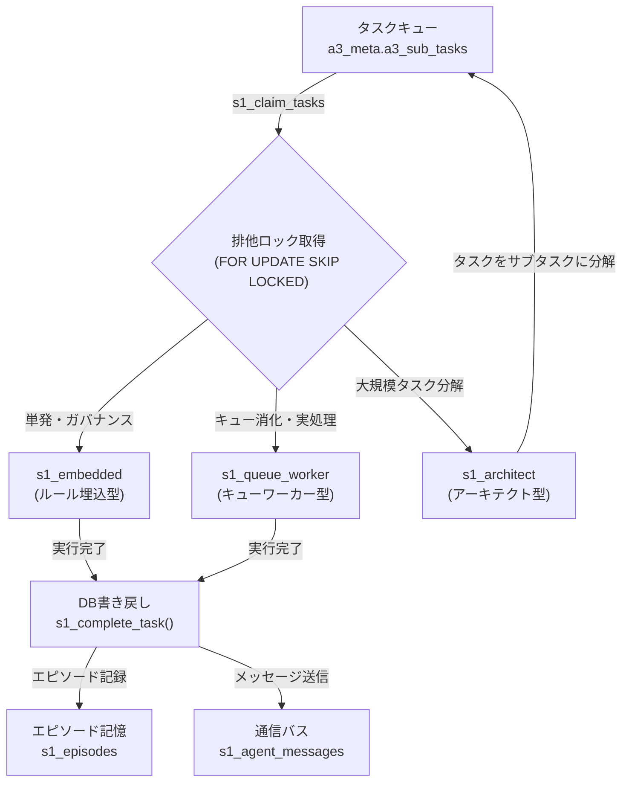
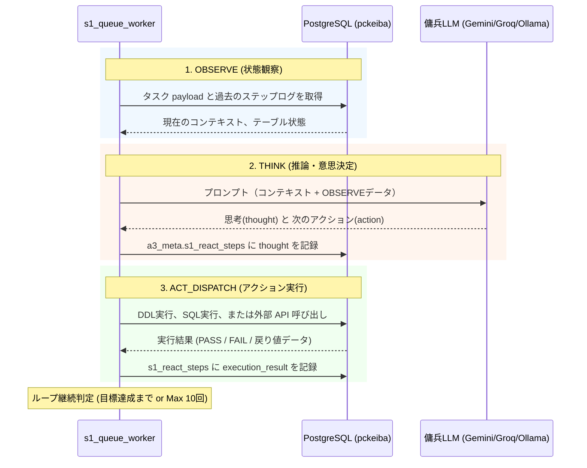

# S1 Sovereign Codex — 04. 自律エージェントエコシステム

> **Phase 623 / 2026-05-22 — S1 Sovereign Factory 自律協調エージェント仕様**

---

## 1. 概要

S1 Sovereign Factory は、高度に自律化されたマルチエージェント協調プラットフォームである。

本システムにおけるエージェントは、ローカルやクラウドに常駐するステートフルな Python デーモンではなく、**「ステートレスでDBに駆動される自律実行エンジン」**である。エージェントの思考ステップ、記憶、能力定義、通信、プロンプト、ゴール評価のすべてが PostgreSQL 15 データベース（`pckeiba`）内に永続化されている。

これにより、コンテナの再起動や OOM Killer によるプロセス消失が発生しても、エージェントの状態は 1 ミリ秒も失われず、別のコンテナで稼働するエージェントが即座に処理を引き継ぐことができる**「プロセス不沈（No-Kill）」**の強靭性を実現している。

---

## 2. 3種のサブエージェント定義と役割

S1は、全プロジェクト（S1/A3/H1）のタスクキュー `a3_meta.a3_sub_tasks` を共同で監視・消化する3種類の自律エージェントを定義している。これらは、旧来の Python 駆動型バケツリレーオーケストレーター（`a3_pipeline_orchestrator.py`）を発展的に置き換えたものである。

**【自律群スウォームアーキテクチャ (Phase 623追加)】**
Phase 623 において、最大18体規模のサブエージェント群がタスクキューを並行監視し、バグの並列修復・インフラ実装などを同時に実行する「自律群（スウォーム）実装体制」が確立された。単一のメインエージェントがボトルネックとなることなく、並列にディスパッチされたタスクをそれぞれ独立したサブエージェントが消化・監査・引き継ぎまで完遂する。



### 2.1 `s1_embedded` (単発ルール順守型)

- **役割**: システムの整合性、ガバナンスの監視、およびパッチの自動適用を行う超軽量エージェント。
- **特徴**: コンテキストに「S1コア憲法」「DB物理スキーマ情報」「直近のエラー定義」などの限定されたメタルールがあらかじめ埋め込まれている。
- **用途**:
  - セッション開始時の `check_handover_integrity` の検証。
  - `a3_governance.py --preflight` の結果に基づく自動修復（`--fix`）。
  - DBマイグレーションに伴うDDLの作成および事前監査。
  - 例外発生時のログ調査および軽微なスペルミス等のパッチ適用。

### 2.2 `s1_queue_worker` (キューワーカー型)

- **役割**: タスクキュー（`a3_sub_tasks`）に投入された具体的な実務タスク（データ取込、dbt実行、推論、自動betなど）を自律的に引き受けて処理する、エコシステムの主力実行体。
- **特徴**: `a3_meta.s1_claim_tasks()` を用いた行レベル排他制御（`FOR UPDATE SKIP LOCKED`）によって、複数コンテナで並列稼働しても重複処理を起こさない。
- **用途**:
  - `DOCKER_EXEC` タイプによる dbt run / dbt test の実行。
  - JRA-VAN JV-Link COM連携による開催データ自動インジェスト。
  - レース開催日のリアルタイムオッズ監視、MoEモデル推論のトリガー。
  - `IPAT_EXEC` タイプによる AngularJS SPA を用いた自動投票 DOM 操作の実行。

#### タスク取得関数: `a3_meta.s1_claim_tasks`
```sql
CREATE OR REPLACE FUNCTION a3_meta.s1_claim_tasks(
    p_conv_id VARCHAR(50),
    p_project_id VARCHAR(10),
    p_limit INT
) RETURNS TABLE (
    sub_task_id BIGINT,
    task_type VARCHAR(50),
    payload JSONB,
    priority INT
) AS $$
BEGIN
    RETURN QUERY
    WITH target_tasks AS (
        SELECT t.sub_task_id
        FROM a3_meta.a3_sub_tasks t
        WHERE t.status = 'QUEUED'
          AND (p_project_id = 'ALL' OR t.project_id = p_project_id)
        ORDER BY t.priority DESC, t.created_at ASC
        LIMIT p_limit
        FOR UPDATE SKIP LOCKED -- 排他制御: 他のエージェントが掴んでいない行のみロック取得
    )
    UPDATE a3_meta.a3_sub_tasks ut
    SET status = 'IN_PROGRESS',
        started_at = CURRENT_TIMESTAMP,
        claimed_by = p_conv_id
    FROM target_tasks tt
    WHERE ut.sub_task_id = tt.sub_task_id
    RETURNING ut.sub_task_id, ut.task_type, ut.payload, ut.priority;
END;
$$ LANGUAGE plpgsql;
```

#### タスク完了報告関数: `a3_meta.s1_complete_task`
```sql
CREATE OR REPLACE FUNCTION a3_meta.s1_complete_task(
    p_task_id BIGINT,
    p_conv_id VARCHAR(50),
    p_result JSONB,
    p_success BOOLEAN
) RETURNS VOID AS $$
DECLARE
    v_status VARCHAR(20);
BEGIN
    IF p_success THEN
        v_status := 'COMPLETED';
    ELSE
        v_status := 'FAILED';
    END IF;

    UPDATE a3_meta.a3_sub_tasks
    SET status = v_status,
        completed_at = CURRENT_TIMESTAMP,
        result_payload = p_result,
        updated_at = CURRENT_TIMESTAMP
    WHERE sub_task_id = p_task_id 
      AND claimed_by = p_conv_id;

    -- 自動評価トリガーや通知バスへのシグナル送信をここで行う
    PERFORM a3_meta.s1_send_message(
        's1_queue_worker',
        's1_architect',
        'TASK_EVENT',
        jsonb_build_object('task_id', p_task_id, 'status', v_status)
    );
END;
$$ LANGUAGE plpgsql;
```

### 2.3 `s1_architect` (並列分解型)

- **役割**: 大規模かつ抽象的な開発目標（ゴール）を分析し、依存関係を持つ並列実行可能なサブタスクに分解してキューにディスパッチする司令塔。
- **特徴**: 他のワーカーの進捗状況を監視し、結果を結合して品質ゲート（`s1_qa_verifier`）を適用する。
- **用途**:
  - 「新しい馬場状態特徴量を20個実装する」といった抽象的な指示を、20個の独立した `SQL_EXEC` および `dbt_run` サブタスクに自動分解。
  - 分解されたタスクツリーの構造的健全性の監視（循環依存のチェック）。
  - サブタスク群の実行が完了した後、データ整合性、テストPASS、ドリフト検知の「品質ゲート」を起動し、マージ判定を行う。

---

## 3. ReAct ループ実行エンジン: `s1_react_execute()`

すべての S1 エージェントは、DB内で管理された ReAct (Reasoning and Acting) ループに従って思考し行動する。

### 3.1 実行ステップ定義 (PL/pgSQL)

```sql
CREATE TABLE a3_meta.s1_react_steps (
    step_id BIGSERIAL PRIMARY KEY,
    task_id BIGINT NOT NULL REFERENCES a3_meta.a3_sub_tasks(sub_task_id),
    loop_count INT NOT NULL,
    observation TEXT,    -- 1. OBSERVE: 現在のDB状態、ログ、前ステップの結果
    thought TEXT,        -- 2. THINK: 思考・推論・次の打ち手の計画
    action_type VARCHAR(50), -- 3. ACT: 実行するアクションタイプ（能力レジストリ）
    action_payload JSONB,
    execution_result TEXT, -- ACT_DISPATCH で得られた結果
    created_at TIMESTAMP WITH TIME ZONE DEFAULT CURRENT_TIMESTAMP
);
```

### 3.2 ReAct ループフロー



### 3.3 `a3_meta.s1_react_execute(task_id)` の処理ロジック

本関数は、PL/pgSQLで記述されたReActのメタ実行コントローラーである。実際のLLM思考処理は Python ラッパーが仲介するが、思考ログの記録と状態遷移のトリガーは完全にDBネイティブで行われる。

```sql
CREATE OR REPLACE FUNCTION a3_meta.s1_react_execute(p_task_id BIGINT)
RETURNS VOID AS $$
DECLARE
    v_loop_count INT;
    v_max_loops INT := 10;
    v_task_status VARCHAR(20);
    v_latest_action VARCHAR(50);
    v_goal_achieved BOOLEAN := FALSE;
BEGIN
    -- タスクの状態を取得
    SELECT status INTO v_task_status FROM a3_meta.a3_sub_tasks WHERE sub_task_id = p_task_id;
    
    IF v_task_status <> 'IN_PROGRESS' THEN
        RAISE EXCEPTION 'タスクは実行中ステータスではありません。task_id: %, 現在の状態: %', p_task_id, v_task_status;
    END IF;

    -- 現在のループ数をカウント
    SELECT COALESCE(MAX(loop_count), 0) INTO v_loop_count 
    FROM a3_meta.s1_react_steps WHERE task_id = p_task_id;

    -- ループ上限チェック
    IF v_loop_count >= v_max_loops THEN
        -- ループ限界に達した場合はFAILEDに遷移（サーキットブレイク）
        UPDATE a3_meta.a3_sub_tasks 
        SET status = 'FAILED', 
            result_payload = jsonb_build_object('error', 'ReAct loop limit exceeded without achieving goal.')
        WHERE sub_task_id = p_task_id;
        RETURN;
    END IF;

    -- 1. OBSERVE & THINK ＆ ACT のメタ状態ログを生成
    INSERT INTO a3_meta.s1_react_steps (
        task_id,
        loop_count,
        observation,
        thought
    ) VALUES (
        p_task_id,
        v_loop_count + 1,
        'Auto-observed database state: features count, queue load, error tables.',
        'Determining next step based on latest DB metadata and available capabilities.'
    );

    -- ※ 実際の外部 LLM による推論とアクションディスパッチは、
    -- Pythonデーモン側がこのステップ挿入イベントを検知（トリガー経由）して非同期に実行する。
    
END;
$$ LANGUAGE plpgsql;
```

---

## 4. DB-First 状態連携とメタデータ設計

S1プラットフォームの最もユニークな特徴は、エージェント協調に必要なすべての共有メモリがDBに集約されている点にある。

### 4.1 エピソード記憶: `a3_meta.s1_episodes`

エージェントが過去に実行したタスクの「成功パターン」および「失敗からの自己修復パターン」を構造化して記録する長期記憶。

```sql
CREATE TABLE a3_meta.s1_episodes (
    episode_id BIGSERIAL PRIMARY KEY,
    task_id BIGINT NOT NULL,
    task_pattern VARCHAR(100) NOT NULL, -- 例: 'dbt_compilation_error', 'ipat_dom_retry'
    steps_count INT NOT NULL,
    outcome VARCHAR(20) NOT NULL CHECK (outcome IN ('SUCCESS', 'FAILURE')),
    embedding vector(1536), -- pgvector を用いたタスク概要のセマンティック埋め込み
    error_message TEXT,
    resolution_summary TEXT,
    created_at TIMESTAMP WITH TIME ZONE DEFAULT CURRENT_TIMESTAMP
);

CREATE INDEX idx_episodes_pattern ON a3_meta.s1_episodes(task_pattern);
```

- **記憶の活用**: エージェントは新しいタスクを開始する際、`pgvector` のコサイン類似度検索を用いて、過去に似たエラーや指示をどのように解決したか（`resolution_summary`）を検索し、プロンプトのコンテキストに注入する。これにより、過去の罠を自律的に回避する能力が飛躍的に向上する。

### 4.2 エージェント間通信バス: `a3_meta.s1_agent_messages`

エージェント間で非同期にメッセージを交換し、作業を調整・協調させるための高信頼メッセージングバス。

```sql
CREATE TABLE a3_meta.s1_agent_messages (
    message_id BIGSERIAL PRIMARY KEY,
    sender VARCHAR(50) NOT NULL,    -- 送信エージェント名
    receiver VARCHAR(50) NOT NULL,  -- 受信エージェント名
    message_type VARCHAR(50) NOT NULL, -- 例: 'TASK_CLAIMED', 'VERIFICATION_REQUEST', 'ALERT'
    payload JSONB NOT NULL,         -- メッセージの詳細データ
    status VARCHAR(20) DEFAULT 'SENT' NOT NULL CHECK (status IN ('SENT', 'READ', 'ARCHIVED')),
    created_at TIMESTAMP WITH TIME ZONE DEFAULT CURRENT_TIMESTAMP,
    read_at TIMESTAMP WITH TIME ZONE
);

CREATE INDEX idx_agent_messages_receiver ON a3_meta.s1_agent_messages(receiver) WHERE status = 'SENT';
```

- **メッセージAPI**:
  - 送信: `a3_meta.s1_send_message(sender, receiver, type, payload)`
  - 受信: `a3_meta.s1_read_messages(receiver, limit)`

### 4.3 プロンプト進化システム: `a3_meta.s1_prompt_templates`

エージェントが使用するプロンプトは静的なファイルではなく、過去のタスク成功率に基づいて動的に選択・進化するテンプレートである。

```sql
CREATE TABLE a3_meta.s1_prompt_templates (
    template_id SERIAL PRIMARY KEY,
    task_pattern VARCHAR(100) NOT NULL,
    version INT NOT NULL,
    system_prompt TEXT NOT NULL,
    user_prompt_template TEXT NOT NULL,
    success_count INT DEFAULT 0 NOT NULL,
    use_count INT DEFAULT 0 NOT NULL,
    success_rate NUMERIC(5,2) GENERATED ALWAYS AS (
        CASE WHEN use_count = 0 THEN 0.00
        ELSE ROUND((success_count::NUMERIC / use_count::NUMERIC) * 100.0, 2)
        END
    ) STORED,
    active_status BOOLEAN DEFAULT TRUE NOT NULL,
    created_at TIMESTAMP WITH TIME ZONE DEFAULT CURRENT_TIMESTAMP
);

CREATE INDEX idx_prompt_templates_rate ON a3_meta.s1_prompt_templates(task_pattern, success_rate DESC);
```

- **自動進化 (Evolution)**:
  `s1_select_best_prompt(pattern)` 関数により、成功率が最も高いテンプレートが自動選択される。
  もし成功率が 70% を下回った場合、`s1_embedded` エージェントが自動的に起動し、エピソード記憶の失敗事例を分析して、システムプロンプトの記述を書き換えた新しいバージョン（例: `version = version + 1`）を自動生成し、登録する。

### 4.4 能力レジストリ: `a3_meta.s1_agent_capabilities`

エージェントが実行可能なアクション（能力）を明示的に定義・制限するセキュリティおよび権限管理レイヤー。

| 能力コード | 許可される物理操作 | 主な使用エージェント |
|---|---|---|
| `SQL_EXEC` | PostgreSQL上でのSELECT/INSERT/UPDATEなどのDML実行 | `s1_embedded`, `s1_queue_worker` |
| `AUDIT` | ガバナンスルールの検証および結果のログ記録 | `s1_embedded` |
| `LLM_PROMPT` | 外部 LLM API に対するクエリ発行と思考生成 | 全て |
| `HEALTH_CHECK` | コンテナの起動状態、メモリ使用率、ディスク容量の取得 | `s1_queue_worker` |
| `DB_DDL` | `CREATE TABLE` / `ALTER TABLE` などのスキーマ定義変更 | `s1_embedded` |
| `TERMINAL` | Docker コンテナ内での bash/powershell コマンド実行 | `s1_queue_worker` |
| `DBT_OP` | `dbt run` / `dbt test` / `dbt compile` の実行とパース | `s1_queue_worker` |
| `BROWSER` | Playwright を用いた Web 画面（IPAT投票ページ）の操作 | `s1_queue_worker` |
| `IPAT_EXEC` | 実際のIPATシステムに対する馬券購入リクエストの送信 | `s1_queue_worker` |
| `BACKUP` | データベースおよびソースコードの自動差分バックアップ作成 | `s1_queue_worker` |
| `DIRECT` | 処理を実行せずメタデータの状態のみを即時更新 | `s1_architect` |

### 4.5 ゴール階層: `a3_meta.s1_goals`

抽象的なゴール（目標）から、具体的なタスクへの紐付け、および達成条件を管理する依存ツリー。

```sql
CREATE TABLE a3_meta.s1_goals (
    goal_id SERIAL PRIMARY KEY,
    parent_goal_id INT REFERENCES a3_meta.s1_goals(goal_id),
    title VARCHAR(100) NOT NULL,
    description TEXT,
    status VARCHAR(20) DEFAULT 'PENDING' NOT NULL CHECK (status IN ('PENDING', 'IN_PROGRESS', 'ACHIEVED', 'FAILED')),
    evaluation_criteria_sql TEXT, -- ゴール達成を自動検証するためのSQL。1が返ればACHIEVED
    created_at TIMESTAMP WITH TIME ZONE DEFAULT CURRENT_TIMESTAMP,
    updated_at TIMESTAMP WITH TIME ZONE DEFAULT CURRENT_TIMESTAMP
);
```

- **自律的ゴール評価**:
  `s1_evaluate_goal(p_goal_id)` 関数が実行されると、`evaluation_criteria_sql` が動的にクエリされる。
  判定が PASS した場合、ステータスは自動的に `ACHIEVED` へ遷移し、親ゴールの評価関数を再帰的にトリガーする。これにより、手動介入なしに「ゴールツリー全体の自動達成判定」が連鎖する。

---

## 5. 統合ダッシュボード: `v_s1_platform_dashboard`

全プロジェクト（A3 / H1 / S1）を横断し、エージェントエコシステム全体の稼働状態、リソース消費、ガバナンス通過率、およびコスト対効果を一元可視化する統合プラットフォームビュー。

```sql
CREATE OR REPLACE VIEW a3_meta.v_s1_platform_dashboard_extended AS
SELECT 
    pd.active_session_id,
    pd.platform_status,
    pd.governance_pass_rate,
    pd.total_governance_checks,
    pd.failed_governance_checks,
    -- タスクキュー消化統計
    pd.completed_tasks,
    pd.queued_tasks,
    pd.failed_tasks,
    pd.active_tasks,
    -- エージェント稼働効率
    (SELECT COUNT(DISTINCT claimed_by) FROM a3_meta.a3_sub_tasks WHERE status = 'IN_PROGRESS') as active_workers_count,
    -- エピソード記憶蓄積数
    (SELECT COUNT(*) FROM a3_meta.s1_episodes) as total_learned_episodes,
    -- プロンプトの平均成功率
    (SELECT ROUND(AVG(success_rate), 2) FROM a3_meta.s1_prompt_templates WHERE active_status = TRUE) as avg_prompt_success_rate,
    -- H1 歴史イベント抽出の進捗状況
    (SELECT COUNT(*) FROM chrono_archive.extracted_events) as h1_extracted_events_count
FROM a3_meta.v_s1_platform_dashboard pd;
```

このビューにより、開発者およびシステム管理者（または自律的に統治権限を持つ `s1_embedded` エージェント）は、**「どのプロンプトが劣化しているか」「どのエージェントがタスクを専有したままZOMBIE化しているか」「ガバナンスが健全に機能しているか」**を 1 クエリで俯瞰し、自律的なスケーリングや自己修復アクションへと繋げることができる。

---

*S1 Sovereign Codex 04 — 自律エージェントエコシステム v1.1 (Phase 623)*


### Phase 6 Architectural Updates
- **Orchestrator Bucket-Brigade**: We have adopted a bucket-brigade "Orchestrator" pattern. The Orchestrator spawns specialized Healer and Sentinel subagents that collaboratively execute self-healing and task management.
